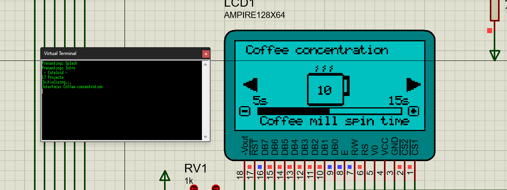
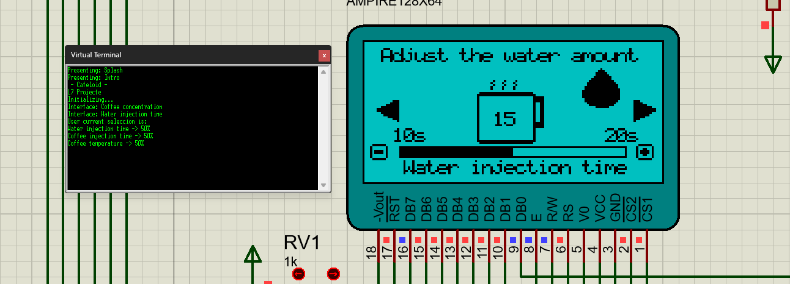
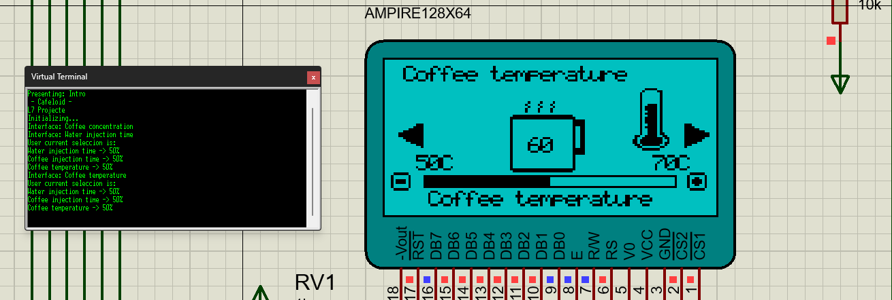

# FINAL LAB REPORT 7 - CI

## Interfaces

[Interface 1]

[Interface 2]

[Interface 3]

## 1. Use of the coffee machine: Main controls.

The coffee machine has 5 buttons: Up, Down, Right, Left, and OK.
- Up: Used to increase a value.
- Down: Used to decrease a value.
- Right: Next interface (see Interface 2).
- Left: Previous interface.
- OK: Prepare coffee.
  
## 2. Use of the coffee machine: Interfaces.

The coffee machine has 3 interfaces where the user can select and personalize their coffee.

- **Water injection time**: The user can select the water injection time, which determines whether the coffee will be long or short. The time is controlled by the variable `inj_time` in the code.

- **Temperature**: The user can select the temperature of their coffee. In the code, the variable `coffee_temp` controls the temperature variability starting from 60°C, represented as a percentage. To determine the selected temperature (printed on the screen and compared with the temperature selected by the NTC resistor), we multiply the variability by a base value of 50 and a length of 0.2 (also in percentage), and add it to the base value (see functions `updateTime()` and `updatePWM()`).

- **Concentration**: The user can select the grinding time to achieve a stronger or milder coffee. The grinding time is controlled by the variable `mill_time` in the code.

It is worth noting that both the analog reading of the NTC resistor and the analog reading of the potentiometer use the same timer and CCP module. The only difference is the channels used for the pins, which are changed in the `ADCON0` register (see functions `getWaterLevel()` and `getTemp()`). We have adjusted the number of timer ticks due to the delay between fan animation frames (see `turnOnFan()`), to ensure it corresponds to the expected time.

## 3. Malfunctions.

In case of a malfunction, the coffee machine can be connected to a computer and controlled, debugged from an external terminal at 115200 bauds.

- Up -> w
- Down -> x
- Right -> d
- Left -> a
- OK -> s

To facilitate debugging, the coffee machine will send informative messages through the terminal. To indicate the water tank status, a drawing of a drop (in the `water_injection_time` interface) is displayed, which corresponds to the value read from the potentiometer and shows the level of water. For the operation of our coffee machine, we have made it not brew coffee when the water tank is at a low level (i.e., for values <= 1V).
